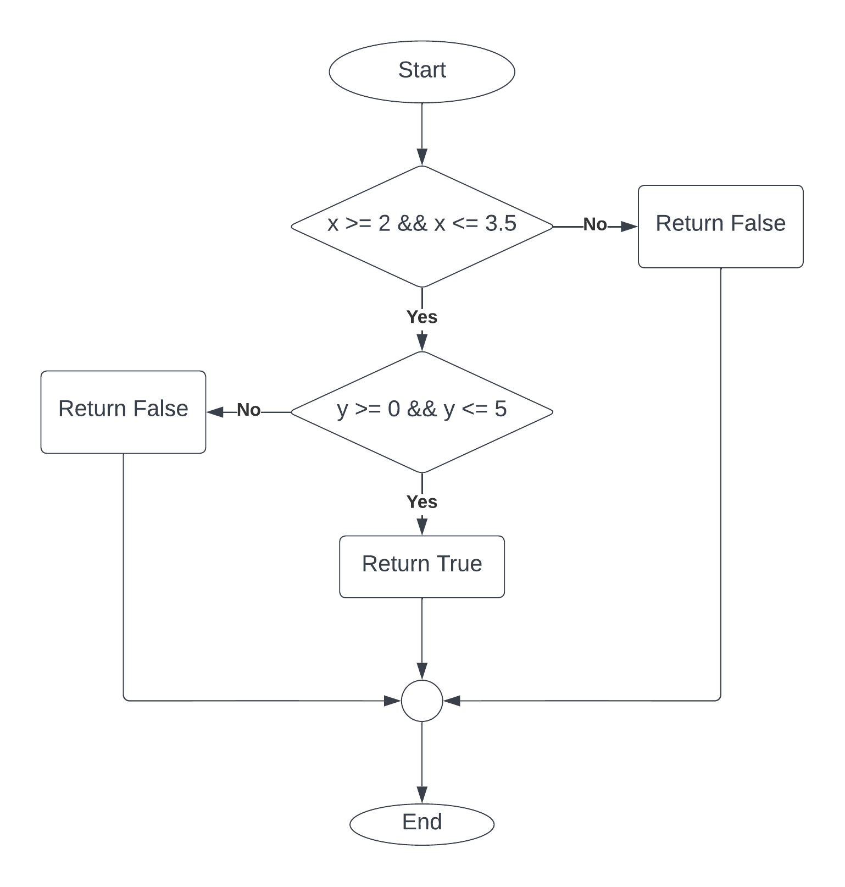
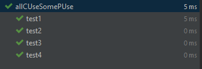

# DFTesting
## CFG

## Mã nguồn
1.     public boolean isBelongRectangle(double x, double y) {
2.         if (x >= 2 && x <= 3.5) {
3.             if (y >= 0 && y <= 5) {
4.                 return true;
5.             } else {
6.                 return false;
               }
7.         } else {
8.             return false;
9.         }
10.     }

## Testcases all-c-uses/some-p-uses
- Biến x:
    - def(x): 1
    - p-use(x): 2
    - c-use(x): không có
- Biến y:
    - def(y): 1
    - p-use(y): 3
  - c-use(y): không có

| Variable | Du-pair   | Def-clear path | Complete path    |
|----------|-----------|----------------|------------------|
| x        | (1, 2(T)  | 1, 2(T)        | 1, 2(T), 3(T), 4 |
|          | (1, 2(F)  | 1, 2(F)        | 1, 2(F), 8       |
| y        | (1, 3(T)) | 1, 2(T), 3(T)  | 1, 2(T), 3(T), 4 |
|          | (1, 3(F)) | 1, 2(T), 3(F)  | 1, 2(T), 3(F), 6 |

## Kết quả
| ID | Input x | Input y | Expected Output | Actual Output | Result  |
|----|---------|---------|-----------------|---------------|---------|
| 1  | 3       | 5       | True            | True          | Passed  |
| 2  | 0       | -5      | False           | False         | Passed  |
| 3  | 3       | 2       | True            | True          | Passed  |
| 4  | 3       | 7       | False           | False         | Passed  |

 